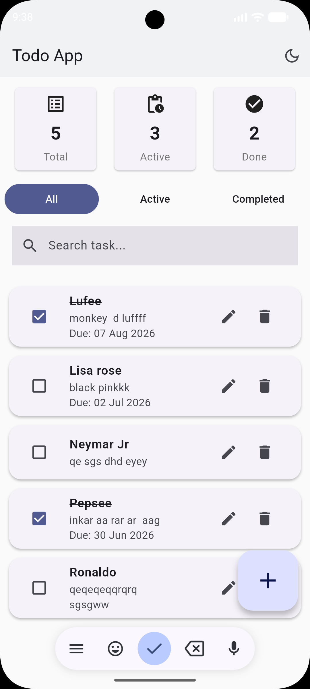

# Todo App

A Flutter Todo List application built as a technical assessment.
-----

## Features
- Add, edit, delete tasks
- Complete/incomplete toggle
- Filter by All / Active / Completed
- Search by title
- Due date picker
- Dark mode support

## Architecture
Clean Architecture with 3 layers:
- **Presentation** — Flutter UI, BLoC state management
- **Domain** — Entities, Use Cases, Repository interfaces
- **Data** — Repository implementation, Hive local storage

## Tech Stack
- Flutter
- flutter_bloc — state management
- Hive — local storage
- equatable — value equality
- uuid — unique ID generation

## Getting Started
1. Clone the repo
2. Run `flutter pub get`
3. Run `flutter run`